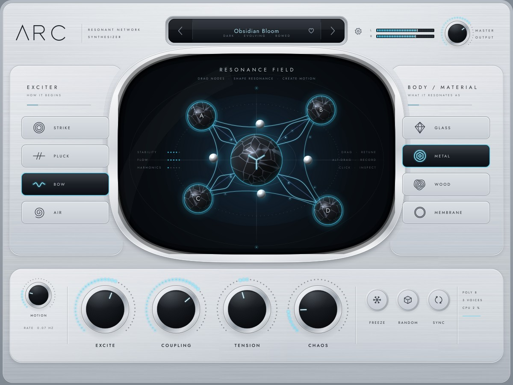

# ARC — RELEASE CANDIDATE REPORT

ARC 1.0.0 — Resonant Network Synthesizer. Release candidate built, tested and validated
on Linux (Ubuntu 24.04, GCC 13.3, JUCE 8.0.12, 4 vCPU cloud container, no physical
display or audio device). Every figure below was measured on this build. Anything that
could not be tested here says **UNVERIFIED — ENVIRONMENT LIMITATION**.

---

## BUILD

**Formats**
* VST3 and Standalone: built and validated.
* AU: enabled automatically by CMake on macOS; not built here (UNVERIFIED —
  ENVIRONMENT LIMITATION).

**Configuration**
* Toolchain: CMake ≥ 3.22, C++20, JUCE 8.0.12 (local path, `external/JUCE` or pinned
  download).
* Release build with LTO (GCC: parallel `-flto=auto`). Plugin code `Arc1`, bundle
  `com.arcinstruments.arc`, stereo out, MIDI in, zero latency.
* Warnings: the engine is built with `-Wall -Wextra -Wpedantic -Wshadow -Wconversion -Wdouble-promotion`,
  the plugin with JUCE's recommended warning flags. A **clean rebuild** from an
  empty build directory succeeds in 4 min 18 s on 4 cores with **0 warnings** (123
  build steps: engine, plugin formats, tests).
* Options: `ARC_BUILD_TESTS`, `ARC_ENABLE_LTO`, `ARC_ENABLE_ASAN`, `ARC_ENABLE_UBSAN`,
  `ARC_ENABLE_TSAN`.

**Artifact locations**

| Artifact | Path |
|---|---|
| VST3 | `build/ARC_artefacts/Release/VST3/ARC.vst3` |
| Standalone | `build/ARC_artefacts/Release/Standalone/ARC` |
| AU (macOS) | `build/ARC_artefacts/Release/AU/ARC.component` |
| Test runner | `build/ARCTests_artefacts/Release/ARCTests` |

## SYNTHESIS ENGINE

**Resonator architecture** (RESONATOR_DESIGN). Each resonator is a waveguide loop:
* a delay line with a first-order allpass fractional delay, exactly matched at f0;
* a two-point one-pole loss filter giving frequency-dependent T60, with a DC bound;
* 2–6 dispersion allpasses whose phase delay is subtracted from the loop length.

Measured pitch is exact to 0.00007 cents from C1 to C6 at 44.1–192 kHz. T60 is within
0.004 % at f0 and 1.4 % at HF.

**Network architecture** (NETWORK_COUPLING). Five loops (CORE, A, B, C, D) exchange
energy every sample through a 5 × 5 orthogonal scattering matrix. The edges are 4
spokes, a ring A–B–D–C and 2 cross edges; the topologies STAR / RING / WEB / CHAIN
select which are active. The exciter drives the CORE, and the stereo pickup sums all
five loops. The field on screen draws this exact network.

**Coupling / stability strategy.**
* Coupling is a rotation, not a feedback gain: the Cayley transform of a skew-symmetric
  generator is orthogonal for any coupling, topology or edge order (measured
  ‖QᵀQ − I‖ ≤ 9.4e-8).
* Automation interpolates between orthogonal matrices, whose convex combinations have
  norm ≤ 1.
* Loops are passive.
* Coupling-induced detuning is compensated per node from an exact Schur-complement
  reduction, with a coincidence taper, under-relaxation 0.25 and ±30 % authority.
* Feedback exciters are collocated at the CORE, and driven voices soft-limit their edge
  rotations.
* FREEZE has an energy governor.

Results:
* 3000 random networks under abusive and realistic modulation: 0 non-finite samples.
* A lossless network conserves energy to 0.4 % over 10 s.
* Coupled fundamentals stay in tune over the **whole COUPLING range** on all four
  materials: ≤ 1.2 cents up to 0.65, ≤ 6.3 cents at the maximum (metal). Uncompensated,
  the same networks drift by up to 175 cents.
* The knob ends at the largest coupling where every material can still be held in tune.
  The validation found the old top of the range detuned, and this was fixed
  (NETWORK_COUPLING §6.2).

## EXCITERS

* **Strike.** A momentum-normalised contact pulse: contact time 0.25–9 ms,
  hardness-sharpened, with contact noise. Harder strikes are brighter, not louder in the
  bass: centroid 862 → 2270 Hz. Energy is front-loaded on every material.
* **Pluck.** A finger drag and release, a Karplus-style burst, then a fractional
  pluck-position comb. Position ¼ notches h4 by 37 dB; position ½ removes even harmonics
  (−37 … −40 dB). DAMP acts as a palm mute.
* **Bow.** Stick-slip friction on the CORE's own motion (Smith / Cook table, stick
  region relative to bow velocity) with an intonation tracker. It speaks at every
  PRESSURE × SPEED on every material: level −40 … −19 dB, HNR 25–48 dB, pitch ≤ 0.4
  cents. It is tonal, not noise (spectral flatness ≤ 1.2e-5).
* **Air.** Turbulence plus an in-phase air-column drive normalised to the CORE's actual
  loss, so the self-oscillation threshold is the same on every material. FLOW moves
  from breath to tone. Pitch is within 0.6 cents (MEMBRANE +6 … +8 cents from its
  energy-dependent tuning, see Known limitations).
* All 16 exciter × material pairs sit at −22 dB RMS ± 3 dB (AIR ± 5 dB) from C2 to C6.

## MATERIALS

* **Glass.** Thin-shell ratios 2.63 / 4.45 / 6.55 / 9.40, long bright decay (T60 5.2 s
  at f0), selective ports.
* **Metal.** Bell ratios with a nominal-octave doublet ("complex beating"), strong
  dispersion and coupling, T60 8.2 s.
* **Wood.** Free-bar modes 2.756 / 5.404 / 8.933 / 13.34, fast HF loss (T60 0.9 s),
  warm (centroid 605 Hz).
* **Membrane.** Circular-membrane (Bessel) ratios, heavy dispersion, pitch glide with
  energy (tension modulation), T60 0.86 s.
* Materials reshape the network itself (ratios, T60 curves, dispersion, coupling, port
  selectivity, energy tuning); they are not EQs. The minimum distance between any two
  materials is 28 dB (strike) and 4.2 dB (bow). Morphing is continuous (worst HF event
  3.9 dB).
* The inspector modifiers are measured to act: MASS, BRIGHTNESS, LOSS, INHARMONICITY.
* TENSION stretches the partials without moving the pitch (≤ 0.27 cents).

## PERFORMANCE

* **Polyphony.** 1–16 voices (default 8) on 20 physical voices, so a stolen voice fades
  out in its own slot while the new note starts at once.
* **Voice stealing.** The quietest released voice goes first, then the quietest held
  one; 5 ms fades. Storms at 1 / 4 / 8 / 16 voices: max active = polyphony + 1, 0 hard
  steals, 0 stuck voices. The worst steal transient is 4.7 dB above its neighbourhood
  (click criterion 12 dB).
* **MIDI.**
  * Sample-accurate.
  * Pitch within 0.66 cents from C1 to C6; bend 0–24 semitones (0.004 cents after a
    bend).
  * Velocity per exciter.
  * Sustain pedal; channel / poly aftertouch.
  * CC74 timbre.
  * MPE lower zone with per-note bend (0.005 cents).
  * Poly / mono / legato (glide lands within 0.015 cents).
  * Same-note re-strike.
* **Motion.** Drift (sines and bounded random walks) moves the real node geometry:
  radius range 0.20 at depth 1, exactly 0 at depth 0. Under SYNC it is phase-locked to
  the host timeline (identical at the same bar position).
* **Gesture recording.** Alt-drag or REC records a 128-point looping path, closed
  modulo whole turns, stored exactly (9 digits) in presets and sessions. With SYNC it
  follows host tempo (2.000 s at 120 BPM, 2.667 s at 90 BPM for a 1-bar gesture).
* **Freeze.** Holds the energy of the sounding voices: level change ≤ 0.23 dB from 2 s
  to 19 s, including CHAOS 1 + MOTION 1. It engages smoothly (2.8 dB HF event), and
  notes played while frozen decay normally.
* **Random.**
  * Gentle mutation: largest normalised step 0.0995, discrete choices unchanged.
  * Shift regenerates from material-aware distributions: 24 / 24 patches speak, all
    exciters and materials drawn, −35.8 … −21.8 dB. CHAOS is reseeded.
  * Performance and setup parameters are never randomised.
* **Sync.** Drift and gestures lock to host tempo and position at 1/4, 1/2, 1, 2, 4 or 8
  bars.
* **Presets and state.**
  * **396 factory presets** in 12 categories: the 46 signature sounds (including all 25
    names from the brief) and a 350-preset library added after the release candidate
    (Phase 16; catalogue in [PRESETS](PRESETS.md)).
  * The library audit renders every preset: 396 / 396 clean (the chord and hard single
    notes C2 / C4 / C6 all peak below −1 dBFS) and true to their category. 289 / 289
    pitched presets are in tune within 12 cents. All sit at −21 dB ±2 momentary loudness,
    or lower where a hard note's peak held the trim at −3 dBFS (short hits). The closest
    pair is 2.13 apart.
  * Each preset stores a measured PATCH LEVEL trim, applied per note, so switching
    presets never lifts a ringing tail.
  * The browser searches as you type and shows per-category counts; only visible rows are
    painted.
  * Session state restores bit-identically; 66 parameters with stable versioned IDs.

## UI

* **Silver design implementation.** A locked-reference layout on a 1200 × 900 canvas
  with a machined-silver chassis, raised plates, a recessed preset tray and a chrome
  chamber bezel. Everything is drawn procedurally from one token set, and the embedded
  Jost type is used in tracked small caps. The silver share matches the reference
  (66.7 % vs 67.7 % of pixels). A final measured contrast pass brought the silver tone,
  label ink, knob bezels and tile outlines toward the reference while keeping ARC's
  cleaner finish.
* **Resonance Field.** The largest element (28 % of the canvas). Nodes sit at their DSP
  positions (parameters plus live motion), and the connections are the active
  topology's edges weighted by the coupling in use. Halos, flows, strike rings, frost,
  tremor and ring spacing are driven by telemetry (energy, edge flux, strikes, FREEZE,
  CHAOS, TENSION). The chamber header doubles as the help caption.
* **Node interactions.**
  * Drag to move and retune (Shift = fine); the node lands 0.04 px from the pointer.
  * Double-click to reset.
  * Alt-drag or REC to record a looping gesture.
  * Click a node or the CORE for its inspector.
* **Contextual inspectors.**
  * Exciter / material detail inside the side panels.
  * Node card: RATIO / DECAY / DAMP / LEVEL / PAN / LINK, REC / LOOP / clear.
  * CORE card: topology, QUANTIZE, SPACE / WIDTH / DRIVE.
  * Settings: voice mode, MPE, voices, glide, bend, release, quality, window size.
  * Preset browser: categories, favourites, audition, save, delete.
  * Cards dock in whichever band is less crowded so they never cover the CORE.
* **Animations.** A display-synced frame clock at 60 fps while sounding or interacting,
  15 fps when idle. Motion is time based and inertial: attack / release smoothing,
  eased cards, fading tile sheen, strike rings, flow pulses.
* **Resize and HiDPI.** 75–150 % (900–1800 px) at a fixed 4:3 ratio, S / M / L / XL
  presets, persisted in the session. Caches and sprites are rendered at the physical
  pixel density (snapshots at 2×).

Screenshots: `docs/images/` (main, node inspector, CORE inspector, settings, preset
browser, 2× frozen, and the Linux Standalone window).

## PERFORMANCE MEASUREMENTS

Release build, % of one core of the build machine in real time, NORMAL quality, COUPLING
0.35, CHAOS 0.1 (`docs/measurements/release/cpu_profile.csv`).

**CPU by voice count** (strike / bow)

| voices | 44.1 kHz | 48 kHz | 96 kHz |
|---|---|---|---|
| 1 | 0.8 / 0.8 % | 0.8 / 0.9 % | 1.2 / 1.3 % |
| 4 | 3.6 / 2.8 % | 2.8 / 3.2 % | 4.1 / 4.7 % |
| 8 | 4.8 / 6.2 % | 5.4 / 6.2 % | 8.0 / 8.6 % |
| 16 | 9.4 / 10.8 % | 10.6 / 12.3 % | 16.5 / 20.0 % |

Single runs on this shared machine vary by about ±10 %.

**Extremes at 48 kHz** (strike / bow)

| | 8 voices | 16 voices |
|---|---|---|
| COUPLING 0 | 4.8 / 4.9 % | 9.0 / 10.7 % |
| COUPLING 1 | 4.9 / 5.7 % | 9.8 / 11.2 % |
| CHAOS 1 | 5.9 / 6.3 % | 12.2 / 12.6 % |
| MOTION 1 | 6.3 / 6.5 % | 12.2 / 11.7 % |

**QUALITY** (16 bowed voices, 48 kHz): ECO 8.3 %, NORMAL 11.8 %, HIGH 18.7 %. NORMAL and
ECO are within 1.17 / 1.74 dB log-spectral distance of HIGH at the same pitch (≤ 0.033
cents), and switching live is click-free.

**Sample rates.** Every rate from 22.05 to 192 kHz sounds and stays finite, including
re-preparing mid-session. At 96 kHz, 16 voices cost 16.5 / 20.0 %.

**GUI load.** Software renderer, 8 bowed voices, editor at 1200 × 900:
* Audio thread: 8.8 % of a core with the editor closed, 8.9 % with it open and animating
  at 60 fps (no effect).
* Message thread: 3.0 ms per frame for the regions the editor repaints (17.8 % of one
  core at 60 fps).
* Field frame at 2× density: 4.4–4.5 ms. Full-window repaint (open / resize): 9.4 ms.
* Idle: 15 fps.

## TESTING

**Tests actually run** (all on this build):
* Release suite: **90 tests, 1004 checks, 0 failures** (103 s), after the Phase 16
  preset library. Groups:
  resonator 11, network 11, exciters 6, tuning 8, materials 4, soundcheck 1, voices 10,
  motion / gesture / chaos / freeze / nonlinear 10, presets / random / state 9,
  library 2, performance 3, realtime 2, host 4, ui 7, smoke / docs 2.
* AddressSanitizer + UndefinedBehaviorSanitizer, final code: the **full suite** (86 tests,
  939 checks, 325 s). **No reports.**
* ThreadSanitizer, final code: the 12 threaded tests (realtime concurrency, host, node
  drag, gesture recording, and the editor at 60 fps against live audio). **No race
  reports.**
* Allocation detector: **0 allocations** on the audio thread in 640 blocks, with MIDI,
  preset / gesture changes and structural automation.

**Results.** Every quality-gate criterion passes (CORE_QUALITY_GATE). The suite found
real defects that were fixed:
* a coupling-compensation limit cycle;
* non-collocated feedback forces;
* a bow playability hole;
* a wolf-tone silence at high coupling;
* voices following the global exciter switch;
* gesture precision loss on save;
* a node grab-offset jump;
* the boolean-parameter restore issue;
* editor state shared between plugin instances.

Rendered WAVs, CSV measurements and UI snapshots are produced by every run, and curated
copies are kept in `docs/measurements/`.

## VALIDATION

| Validator / check | Result |
|---|---|
| pluginval 1.0.4, strictness 10, in-process, GUI tests on (VST3) | **SUCCESS**: 25 test groups, including editor, editor while processing, editor automation, state and state restoration, background-thread state, parameter thread safety, fuzzing, bus layouts, and audio at 44.1 / 48 / 96 kHz × 64–1024 blocks |
| Steinberg VST3 validator (VST3 SDK 3.8, built from source) | **47 / 47** standard tests; **537 / 537** extensive (`-e -l`); also exit 0 as pluginval's validator step (bundle-path wrapper, see TESTING) |
| Instantiation, destruction, editor open / close, MIDI, state, automation | pass (pluginval + `host` tests) |
| Sample-rate changes, block-size changes | pass: 22.05–192 kHz; blocks 1–4096 bit-identical |
| Multiple instances | pass: isolated (difference 0) |
| Bypass, preset switching | pass: bypass outputs silence and processing continues cleanly afterwards; 94 preset switches under load, peak −7 dB |
| Standalone launch (Xvfb) | pass: window up in 3.8 s, editor fully rendered, alive until closed (`docs/images/arc_standalone_linux.jpg`). There is no audio or MIDI device in the container, as expected |
| AU / auval, macOS, Windows, real DAWs | **UNVERIFIED — ENVIRONMENT LIMITATION** |

## QUALITY GATES

| Gate | Verdict |
|---|---|
| RESONATORS | **PASS** |
| NETWORK | **PASS** |
| EXCITERS | **PASS** |
| MATERIALS | **PASS** |
| POLYPHONY | **PASS** |
| MOTION | **PASS** |
| UI | **PASS** (appearance on a physical HiDPI display in a DAW: UNVERIFIED — ENVIRONMENT LIMITATION) |
| VALIDATION | **PASS** on Linux (AU / macOS / Windows: UNVERIFIED — ENVIRONMENT LIMITATION) |

## KNOWN LIMITATIONS

Only issues that are genuinely unresolved in this build:

1. **Platform coverage: UNVERIFIED — ENVIRONMENT LIMITATION.** macOS and Windows
   builds, the AU format with `auval`, and sessions in real DAWs (Live, Logic, Reaper,
   Bitwig, Cubase) could not be run on this Linux container, which has no display or
   audio device. The code is portable C++20 / JUCE 8 but has been compiled only with
   GCC 13 here.
2. **METAL is slightly flat at the very top of COUPLING.** The fundamental is −2.8
   cents at 0.8 and −6.3 cents at 1.0 (≤ 1.2 cents up to 0.65). This is the residual of
   the first-order mode condition on METAL's dispersive CORE. Glass, wood and membrane
   stay within 0.3 cents.
3. **MEMBRANE + AIR plays 6–8 cents sharp** (C3), from the membrane's energy-dependent
   tuning, which the sustained-exciter intonation tracker does not fully cancel.
4. **GUI cost was measured only with JUCE's software renderer** (Linux): 3.0 ms per
   frame at 1×, 4.5 ms for the field at 2×, and a 9.4 ms full-window repaint on resize.
   CoreGraphics (macOS) and Direct2D (Windows) timing and appearance are unmeasured.
5. **The Standalone app's window chrome and audio / MIDI settings dialog** are JUCE's
   standard ones, not ARC-styled.
6. **MPE** supports the lower zone only. It is switched on in settings; MPE
   Configuration Messages are not parsed.

## NEXT VERSION

Optional future work, not required for V1:
* Preset morphing (the state already stores everything a morph needs).
* A GPU (OpenGL / Metal) path for the field if on-hardware profiling asks for it.
* Larger networks (16+ nodes) and user-drawn topologies.
* Audio-input excitation; granular / spectral exciters.
* Advanced MPE (per-note slide to node position); microtuning / Scala.
* Multiband coupling; full WDF bodies and collision models.
* macOS / Windows CI with auval and a DAW compatibility matrix.
