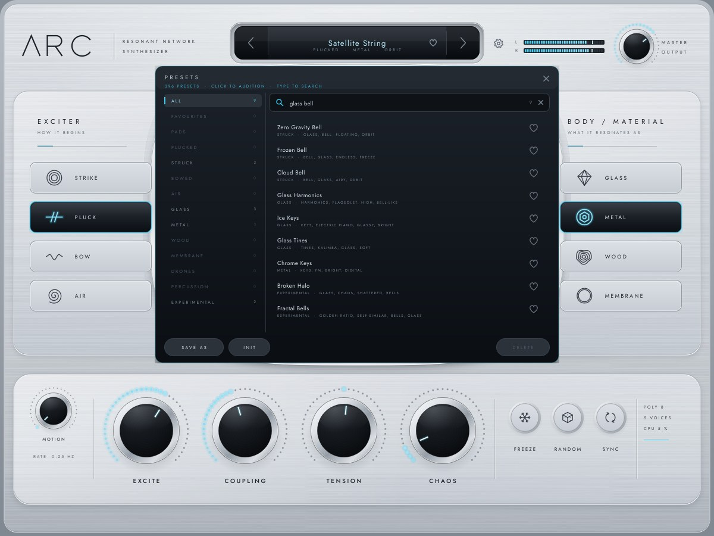
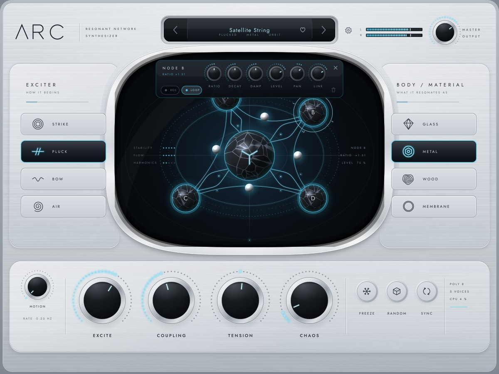

# ARC — UI System

The editor is built around one idea: **the network you hear is the network you see and
touch.** Everything else is kept quiet around it: the machined silver chassis, the
exciter and material panels, and the macro strip.

Code: `Source/PluginEditor.*` (layout, frame clock, overlays), `Source/UI/*` (theme,
controls, panels, field, inspectors, browser), `Source/Graphics/*` (silver surfaces,
icons, logotype). Reference: `design/reference/ARC_LOCKED_REFERENCE.png`.
Snapshots: `docs/images/` (rendered by `Tests/UiTests.cpp`).

## 1. Art direction

| Principle | How it is applied |
|---|---|
| Silver instrument, dark chamber | Machined satin-aluminium chassis and plates; the Resonance Field is a deep graphite chamber behind a polished chrome bezel |
| Light is energy | Ice-cyan appears only where there is signal or state: node halos, energy flows, lit value dots, the selected exciter / material, meters, active buttons. Amber is reserved for gesture recording |
| Physical, not decorative | Raised plates cast soft shadows, the preset display sits in a recessed tray, knobs have chrome rings and graphite caps. Every control reads as a part of the machine |
| Minimal controls | One screen and no keyboard. Four macros, three performance buttons, two selectors. Detail lives in contextual inspectors that appear only when asked for |
| Restrained typography | One typeface (Jost, SIL OFL 1.1, embedded), wide-tracked small caps for labels, sentence case only for preset names |

**Measured colour balance.** The same pixel classifier was run on the reference and on
the snapshot (silver = light neutral, dark = L < 0.35, cyan = saturated 170–215° hue):

| | silver | dark | cyan |
|---|---|---|---|
| Locked reference | 67.7 % | 29.3 % | 3.0 % |
| ARC (Obsidian Bloom, bowed chord) | 66.7 % | 32.1 % | 1.2 % |

Silver dominates in the same proportion as the reference. ARC's cyan is deliberately
more concentrated: thin flows and dots rather than broad glows. It also rises and falls
with the sound, because it is driven by telemetry.

## 2. Design tokens

The palette lives in `Source/UI/Theme.h`. The only literal colours elsewhere are
gradient stops inside the material painters (chrome rings, the chamber's depth gradient,
the glass card body), which are tuned to this palette.

| Group | Tokens |
|---|---|
| Silver chassis | `chassisHigh #E3E7EC`, `chassisMid #CBD0D7`, `chassisLow #B0B7BF`, `chassisEdge #808891`, `panelFace #D8DDE3`, `panelFaceLow #C7CDD4`, `bevelLight #F8FAFC`, `bevelDark #8A929B`, `hairline #A6ADB5` |
| Ink on silver | `ink #1C2229`, `inkSoft #353C45`, `inkMuted #5D6570`, `inkFaint #828A94` |
| Graphite | `chamberDeep #05070A`, `chamber #0B0F14`, `chamberLift #161B22`, `graphite #1B2026`, `graphiteHigh #2C323A`, `graphiteLine #39414B` |
| Signal | `cyan #45CDF2`, `cyanBright #9EEAFF`, `cyanDim #1D7FA3`, `ice #D8F6FF`, `blue #4F7FD6`, `violet #8A7AD6`, `amber #E9B45C` (recording only) |
| Text on graphite | `glassText #DBE6EE`, `glassMuted #7F8C98`, `glassFaint #4D5864` |

The silver tokens were tuned against the reference in a measured pass during Phase 15.
The side-panel face went from RGB (210, 213, 217) to (198, 204, 211); the reference is
(189, 196, 206). The strip went from (228, 230, 232) to (216, 220, 225). Both are now
cooler, with a blue cast like the reference's. Mean lightness of all silver pixels is
210, against 182 in the reference. The darkest pixels of the macro labels went from
RGB (103, 109, 116) to (33, 39, 46); the reference's are (32, 40, 49). The goal was
legibility and the reference's machined contrast, while keeping ARC's brighter,
cleaner finish.

**Typography.** Jost Light / Regular / Medium (static instances cut from the variable
font, embedded through `BinaryData`, falling back to the platform sans if loading ever
fails). Sizes on the 1200 × 900 canvas:

| Use | Size and tracking |
|---|---|
| Panel headings | 16.5 px, 0.30 em |
| Subheadings | 10 px, 0.24 em |
| Macro labels | 14.5 px Medium, 0.18 em |
| Tile labels | ≤ 13.5 px, 0.18 em |
| Preset name | 0.34 × display height |
| Small readouts | 10 px |

`drawTrackedText` places tracked text optically: centred text is shifted by half the
trailing tracking.

## 3. Layout

A fixed 1200 × 900 design canvas (4:3), taken from the reference and scaled uniformly:

| Region | Canvas rectangle | Contents |
|---|---|---|
| Header | y 38–134 | logotype + "RESONANT NETWORK SYNTHESIZER"; preset display `‹ name ♡ ›` with tags (394, 44, 412 × 56); settings gear; L/R meter (866, 60, 150 × 36); MASTER OUTPUT knob |
| Left panel | 23, 153, 263 × 442 | EXCITER — "how it begins": STRIKE / PLUCK / BOW / AIR |
| **Resonance Field** | 276, 126, 648 × 468 | CORE + nodes A–D, energy connections, readouts, caption (largest element: 303 k px², 28 % of the canvas) |
| Right panel | 914, 153, 263 × 442 | BODY / MATERIAL — "what it resonates as": GLASS / METAL / WOOD / MEMBRANE |
| Strip | 23, 628, 1154 × 218 | MOTION depth + rate · EXCITE · COUPLING · TENSION · CHAOS · FREEZE · RANDOM · SYNC · live status |

Each side panel is 116 k px² and the strip 252 k px². The field is the largest element,
and the chrome bezel frames it as the visual centre. The side panels' inner edges tuck
under the bezel.

## 4. Surfaces and rendering

* **Chassis.** Darker satin frame → main plate (vertical satin gradient), 4.5 % brushed
  grain (procedural texture, fixed seed), broad top sheen, machined bevel (light upper
  lip, dark lower edge).
* **Raised plates** (panels, strip): drop shadow, face gradient, grain, top-left sheen,
  bright lip / dark edge. **Recessed tray** (preset display): inner top shadow.
  **Chrome bezel** (chamber): multi-stop polished gradient with a drop shadow.
* **Cached layers.** All static artwork is drawn once into a `CachedLayer` at the
  **physical pixel density** of the target context. It stays sharp at any editor scale
  or display scale factor, and is rebuilt only on resize or scale change. The chassis
  and the field's static layer are opaque (RGB, no alpha blending when blitted).
* **Sprites.** Node and CORE spheres (procedural obsidian with facets and a specular
  highlight) and halos are rendered once at device resolution and blitted 1 : 1.
* **Knobs.** Four styles (macro, master, small, glass). Each has a segmented value ring
  (dots, lit up to the value or from the centre for bipolar parameters, brightest near
  the value), a polished chrome ring and a graphite cap with faint machining. A white
  pointer carries a cyan glow. Hovering shows the value in place of the name.

## 5. The Resonance Field

**Geometry is the DSP's.** Node positions come from each node's radius and angle
parameters plus the live MOTION / gesture offsets, read from telemetry (effective
radius and angle after motion). The connections drawn are exactly the edges of the
active topology (STAR / RING / WEB / CHAIN). The spheres between the nodes are the ring
junctions.

**Light is measured energy.** Telemetry is read once per frame (lock-free atomics) and
smoothed with attack / release so it feels inertial:

| Visual | Source | Mapping |
|---|---|---|
| Node / CORE halo | per-loop mean-square energy, summed over voices | (dB + 62) / 44 → 0..1; attack 30 ms, release 220 ms |
| Connection brightness | energy crossing each edge per sample | same mapping (× 4); attack 40 ms, release 300 ms |
| Connection weight | coupling actually in use per edge (sin² φ of the rotation) | √ → 0..1, 80 ms |
| Flow pulses along a connection | edge energy | speed 0.08 + 0.9 × brightness cycles / s; frozen with FREEZE |
| Strike rings from the CORE | transient counter + energy | a ring per strike or pluck |
| Frost + stilled flows | FREEZE amount | cross-fades with the engine's freeze smoothing |
| Ring spacing | TENSION | static layer re-rendered in 1/200 steps |
| Tremor | the CHAOS amount; a display cue only (in the DSP, CHAOS acts on detune, coupling and routing) | at most 12 % of a node's radius, smoothed over 250 ms |
| Motion paths / gesture badge | recorded gestures, motion phase | loop drawn in amber while recording |
| STABILITY / FLOW / HARMONICS | 1 − CHAOS; strongest edge flow; closeness of node ratios to half-integer harmonics | 5-dot readouts |
| Right readout | hovered / selected node: name, ratio, level | or interaction hints |

The telemetry wiring is tested (`network/telemetry reflects dsp`). Node energy
telemetry equals the loops' measured mean-square energy within 0.01 %. Edge flux is
exactly zero on edges the topology does not have and non-zero exactly where coupling
is on.

**Interaction.**
* **Drag a node:** it moves and retunes; radius = ratio within ±1 octave, angle = stereo
  position and neighbour distance. Hold Shift for fine control. The node lands exactly
  under the pointer (measured 0.04 px).
* **Double-click** a node to reset it. **Click** a node or the CORE to open its
  inspector; click empty space to close it.
* **Alt-drag** (or arm REC in the node inspector) to record a looping gesture (128
  points, closed modulo whole turns, tempo-snapped with SYNC). A drag around the CORE
  becomes a seamless orbit.
* **The caption is the help system.** The chamber's header shows the name and a
  one-line explanation of whatever is under the mouse, anywhere in the editor. Tooltip
  strings are the single source. While FROZEN the subtitle reads "THE NETWORK HOLDS ITS
  ENERGY".

## 6. Contextual inspectors

The inspectors are dark glass cards that fade in while rising 8 px (60 ms time constant).

| Inspector | Opens from | Contents |
|---|---|---|
| Exciter / Material | choosing a tile (clicking the selected tile toggles it) | the panel's tiles compact into a row and the option's own knobs appear: STRIKE hardness / length / tone, PLUCK position / damp / tone, BOW pressure / speed / friction, AIR flow / turbulence / tone; material mass / brightness / loss / inharmonicity |
| Node | clicking a node | RATIO (shows × ratio) · DECAY (×) · DAMP (×) · LEVEL · PAN (angle, bipolar) · LINK · REC / LOOP / clear motion |
| CORE | clicking the CORE | topology (Star / Ring / Web / Chain; the subtitle names it and adds "SEMITONES" when quantised) · QUANTIZE · SPACE · WIDTH · DRIVE |
| Settings | gear | voice mode (Poly / Mono / Legato) · MPE · voices · glide · bend · release · quality (Eco / Normal / High) · window size (S / M / L / XL) · version and font licence |
| Preset browser | clicking the preset name | search, categories with counts, favourites, click to audition, heart, SAVE AS, INIT, DELETE (user presets) |

The node and CORE inspectors dock in whichever band of the chamber, top or bottom, is
less crowded by nodes, so they never cover the CORE.

### Preset browser

The library is 396 presets, so the browser is built for finding, not scrolling:

* **Search.** Typing anywhere in the sheet goes to the search well at the top of the list
  (a recessed field with a magnifier that lights while it has focus). Every word must
  appear in a preset's name, tags, description or category, so "glass bell" finds 9 and
  "dark" in DRONES finds only dark drones. The well shows the match count, amber when
  nothing matches; × clears it.
* **Counts.** The category rail shows how many presets each category holds, or, while
  searching, how many match there. Categories with no match fade back, so the counts say
  where to look. The search narrows the selected category.
* **Keys.** ↑ / ↓ audition the previous / next result (also from the search field), Enter
  loads and closes, Esc clears the search, then closes.
* **Rows** show the name, then the category (in ALL, FAVOURITES or a search) and the tags;
  hovering shows the description as a tooltip.
* **Size.** 680 × 500, so all 14 rail entries (plus USER) fit. At 620 × 450 the rail's
  last entry, EXPERIMENTAL, was clipped once the library had 12 categories.
* **Cost.** Only the rows inside the viewport are painted: ALL is about 15,000 px of rows,
  a paint draws 10 of them, and the whole sheet paints in about 4 ms (`ui` test).

## 7. Motion, frame clock and cost

* **Frame clock.** `juce::VBlankAttachment` (display-synced). The editor runs at 60 fps
  while there is sound or interaction, and drops to ~15 fps when silent and idle. All
  animation is time based (`smoothTowards`, `easeOutCubic`), so it is identical at any
  frame rate.
* **Per frame** the editor invalidates only the field and the meter; the preset
  display and status are refreshed every 6th frame.
* **Measured** (Release, software renderer, `ui` tests):

| Measurement | Result |
|---|---|
| Field frame at 2× density (steady state) | 4.4–4.5 ms |
| Dirty regions a frame actually repaints, at 1× | 3.0 ms per frame (17.8 % of the message thread at 60 fps) |
| Full-window repaint (open / resize) | 9.4 ms |
| Audio thread, 8 bowed voices, editor closed vs open and animating | 8.8 % vs 8.9 % of a core (no effect) |
| Before the Phase 11 optimisation (cached opaque layers + device-resolution sprites) | 22 ms per field frame at 2× |

The editor only reads relaxed atomics. Under ThreadSanitizer, the editor running at
60 fps against a live audio thread reports no races.

## 8. Resize and HiDPI

* Resizable from 900 × 675 to 1800 × 1350 (75–150 %) with a fixed 4:3 aspect ratio. The
  settings card offers S / M / L / XL (900 / 1080 / 1260 / 1440 px wide). The chosen
  width is saved with the session.
* Everything is drawn in canvas coordinates under one uniform transform. Cached layers
  and sprites are rebuilt at the display's physical scale, so 2× (Retina / 4K) output
  is rendered natively, not upscaled. Snapshots are tested at 2×
  (`docs/images/arc_frozen_2x.jpg`) and at the smallest size.

## 9. Keyboard

| Key | Action |
|---|---|
| ← / → | previous / next preset |
| F | FREEZE |
| R | gentle RANDOM |
| Shift + R | full regeneration |
| Esc | close inspectors and overlays |

## 10. UI quality gate

| Criterion | Status | Evidence |
|---|---|---|
| Layout strongly matches the locked reference | PASS | same regions and proportions (§3); side-by-side snapshots |
| Silver is dominant | PASS | 66.7 % silver vs 67.7 % in the reference (§1) |
| Centre chamber is dark | PASS | graphite chamber; dark share 32 % |
| No piano keyboard | PASS | none; MIDI comes from the host or a controller |
| Controls remain minimal | PASS | 4 macros, 3 buttons, 2 selectors, 1 MOTION control on the surface; the rest is in inspectors |
| Resonance Field is the largest element | PASS | 303 k px² vs 116 k (panels) and 252 k (strip) |
| Nodes correspond to DSP | PASS | positions from the node parameters and the effective motion geometry; drag test lands within 0.04 px and changes radius / angle |
| Energy connections correspond to DSP | PASS | edges of the active topology; brightness and weight from edge flux and rotation telemetry (`network/telemetry reflects dsp`) |
| No generic JUCE styling visible | PASS | every control and popup menu in the editor is drawn by ARC's components and look-and-feel. There are no tooltip windows: help appears in the chamber caption. (The Standalone wrapper's own window title bar and Options menu are JUCE's standard ones.) |
| No VESPER / SPACE / SHAPE / HEAT layout reuse | PASS | layout derived from the ARC reference only |
| Silver material rendering is consistent | PASS | one token set and one set of surface painters (`SilverSurface`) |
| Typography remains restrained | PASS | one family, three weights, tracked small caps |
| Animation is smooth | PASS | display-synced 60 fps; 3.0 ms frame at 1×, 4.5 ms field frame at 2× |
| Resize works | PASS | 900–1800 px, S/M/L/XL, snapshot at the smallest size |
| HiDPI works | PASS | physical-density caches and sprites; 2× snapshots |

Visual judgement beyond these measurements (how the instrument feels on a real Retina or
4K display in a DAW) is **UNVERIFIED — ENVIRONMENT LIMITATION**: this build machine has
no physical display, so the editor was verified under Xvfb and through rendered
snapshots.
