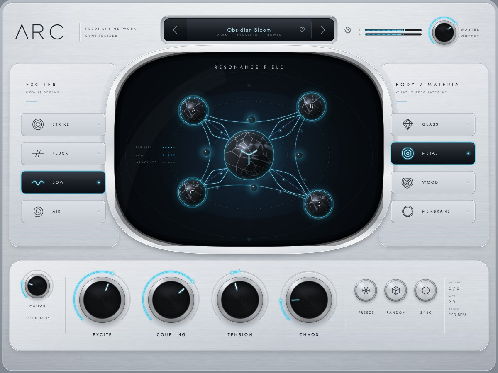
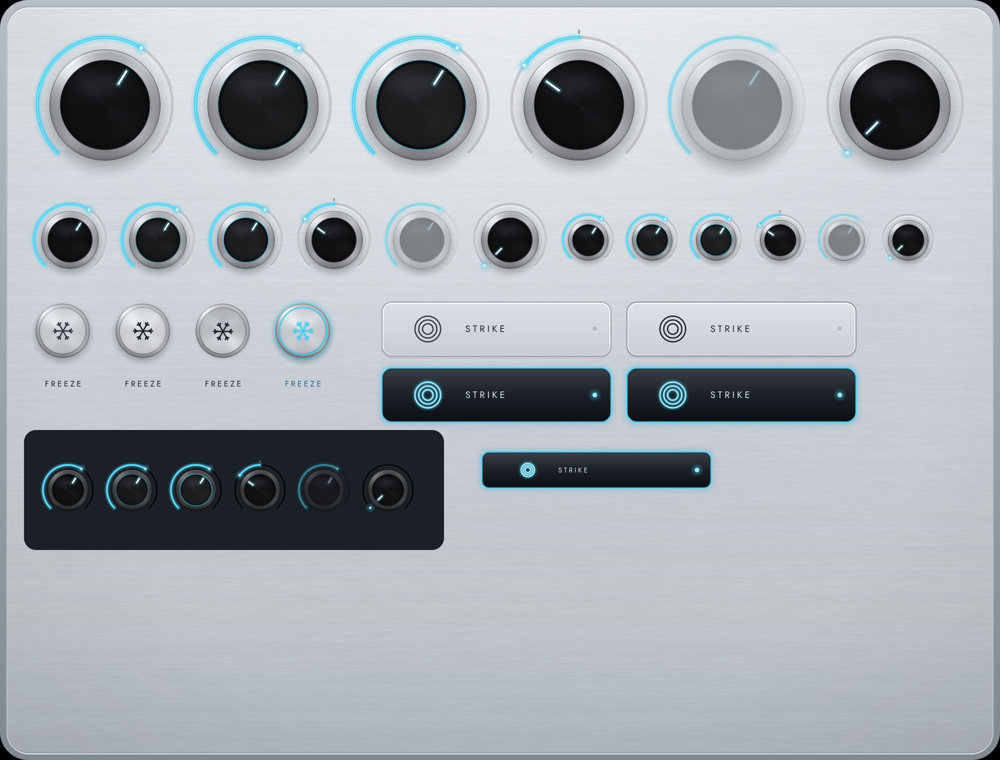
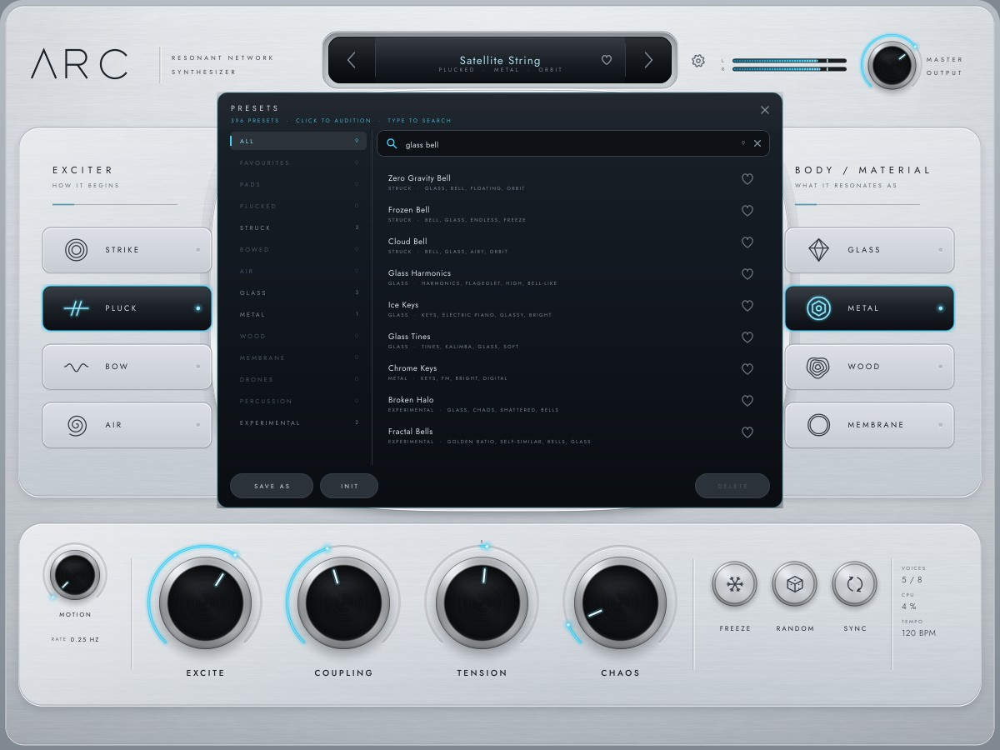
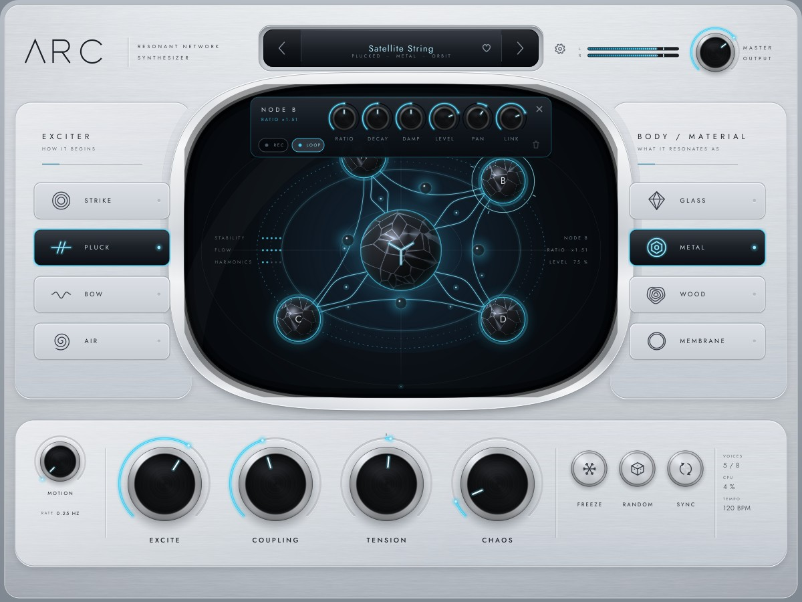

# ARC — UI System

The editor is built around one idea: **the network you hear is the network you see and
touch.** Everything else is kept quiet around it: the machined silver chassis, the
exciter and material panels, and the macro strip.

Code: `Source/PluginEditor.*` (layout, frame clock, overlays), `Source/UI/*` (theme,
controls, panels, field, inspectors, browser), `Source/Graphics/*` (silver surfaces,
icons, logotype). Reference: `design/reference/ARC_LOCKED_REFERENCE.png`.
Snapshots: `docs/images/` (rendered by `Tests/UiTests.cpp`).

## 1. Art direction

| Principle | How it is applied |
|---|---|
| Silver instrument, dark chamber | Machined satin-aluminium chassis and plates; the Resonance Field is a deep graphite chamber behind a polished chrome bezel |
| Light is energy | Ice-cyan appears only where there is signal or state: node halos, energy flows, lit value arcs, the selected exciter / material and its status LED, meters, engaged keys. Amber is reserved for gesture recording (and the meter above 0 dBFS) |
| Physical, not decorative | Raised plates cast soft shadows, the preset display sits in a recessed tray, knobs have turned chrome rings and anodized caps, the performance keys are machined caps. Every control reads as a part of the machine |
| Quiet until asked | Nothing on the surface explains itself permanently: help, hints and detail appear where the mouse is (the chamber caption, the field's hints, the inspectors) and step back afterwards |
| Minimal controls | One screen and no keyboard. Four macros, three performance buttons, two selectors. Detail lives in contextual inspectors that appear only when asked for |
| Restrained typography | One typeface (Jost, SIL OFL 1.1, embedded), wide-tracked small caps for labels, sentence case only for preset names |

**Measured colour balance.** The same pixel classifier was run on the reference and on
the snapshot (silver = light neutral, dark = L < 0.35, cyan = saturated 170–215° hue):

| | silver | dark | cyan |
|---|---|---|---|
| Locked reference | 67.7 % | 29.3 % | 3.0 % |
| ARC (Obsidian Bloom, bowed chord), Phase 15 | 66.7 % | 32.1 % | 1.2 % |
| ARC after the Phase 17 finish pass | 66.3 % | 32.2 % | 1.4 % |

Silver dominates in the same proportion as the reference. ARC's cyan is deliberately
more concentrated: thin flows and arcs rather than broad glows. It also rises and falls
with the sound, because it is driven by telemetry.

## 2. Design tokens

The palette lives in `Source/UI/Theme.h`. The only literal colours elsewhere are
gradient stops inside the material painters (chrome rings, the chamber's depth gradient,
the glass card body), which are tuned to this palette.

| Group | Tokens |
|---|---|
| Silver chassis | `chassisHigh #E3E7EC`, `chassisMid #CBD0D7`, `chassisLow #B0B7BF`, `chassisEdge #808891`, `panelFace #D8DDE3`, `panelFaceLow #C7CDD4`, `bevelLight #F8FAFC`, `bevelDark #8A929B`, `hairline #A6ADB5` |
| Ink on silver | `ink #1C2229`, `inkSoft #353C45`, `inkMuted #5D6570`, `inkFaint #828A94` |
| Graphite | `chamberDeep #05070A`, `chamber #0B0F14`, `chamberLift #161B22`, `graphite #1B2026`, `graphiteHigh #2C323A`, `graphiteLine #39414B` |
| Signal | `cyan #45CDF2`, `cyanBright #9EEAFF`, `cyanDim #1D7FA3`, `ice #D8F6FF`, `blue #4F7FD6`, `violet #8A7AD6`, `amber #E9B45C` (recording only) |
| Text on graphite | `glassText #DBE6EE`, `glassMuted #7F8C98`, `glassFaint #4D5864` |

The silver tokens were tuned against the reference in a measured pass during Phase 15.
The side-panel face went from RGB (210, 213, 217) to (198, 204, 211); the reference is
(189, 196, 206). The strip went from (228, 230, 232) to (216, 220, 225). Both are now
cooler, with a blue cast like the reference's. Mean lightness of all silver pixels is
210, against 182 in the reference. The darkest pixels of the macro labels went from
RGB (103, 109, 116) to (33, 39, 46); the reference's are (32, 40, 49). The goal was
legibility and the reference's machined contrast, while keeping ARC's brighter,
cleaner finish.

**Typography.** Jost Light / Regular / Medium (static instances cut from the variable
font, embedded through `BinaryData`, falling back to the platform sans if loading ever
fails). Sizes on the 1200 × 900 canvas:

| Use | Size and tracking |
|---|---|
| Panel headings | 16.5 px, 0.30 em |
| Chamber title | 15.5 px, 0.34 em |
| Subheadings | 10 px, 0.24 em |
| Macro labels | 14.5 px Medium, 0.18 em |
| Tile labels | ≤ 13.5 px, 0.18 em |
| Preset name | 0.34 × display height |
| Status values / labels | 14.5 px Light / 8.5 px, 0.18 em |
| Small readouts | 9.5–10 px |

`drawTrackedText` places tracked text optically: centred text is shifted by half the
trailing tracking. A label never loses letters: text too wide for its area shrinks (to
70 % at most) instead of being cut. Segmented switches size each segment to its label
(plus an equal share of the spare room), so CHAIN or LEGATO is never clipped.

## 3. Layout

A fixed 1200 × 900 design canvas (4:3), taken from the reference and scaled uniformly:

| Region | Canvas rectangle | Contents |
|---|---|---|
| Header | y 38–134 | logotype + "RESONANT NETWORK SYNTHESIZER"; preset display `‹ name ♡ ›` with tags (394, 44, 412 × 56); settings gear; L/R meter (866, 60, 150 × 36); MASTER OUTPUT knob |
| Left panel | 23, 153, 263 × 442 | EXCITER — "how it begins": STRIKE / PLUCK / BOW / AIR |
| **Resonance Field** | 276, 126, 648 × 468 | CORE + nodes A–D, energy connections, readouts, caption (largest element: 303 k px², 28 % of the canvas) |
| Right panel | 914, 153, 263 × 442 | BODY / MATERIAL — "what it resonates as": GLASS / METAL / WOOD / MEMBRANE |
| Strip | 23, 628, 1154 × 218 | MOTION depth + rate · EXCITE · COUPLING · TENSION · CHAOS · FREEZE · RANDOM · SYNC · live status |

Each side panel is 116 k px² and the strip 252 k px². The field is the largest element,
and the chrome bezel frames it as the visual centre. The side panels' inner edges tuck
under the bezel.

## 4. Surfaces and rendering

* **Chassis.** Darker satin frame → main plate (vertical satin gradient), 4.5 % satin
  brushing, broad top sheen, a soft vignette toward the lower corners, and a machined
  bevel (light upper lip, dark lower edge). The brushing is a procedural 512 px tile
  (fixed seed): each row is one long, soft streak, made of a per-row level loosely tied
  to its neighbours, slow waves whose periods divide the tile, and fine grain smeared
  along the brushing direction by a circular blur. Everything wraps, so the tile repeats
  without seams.
* **Raised plates** (panels, strip): drop shadow, face gradient, brushing, top-left
  sheen, bright lip / dark edge. **Recessed tray** (preset display): inner top shadow.
  **Chrome bezel** (chamber): multi-stop polished gradient with a drop shadow.
* **Glass.** The preset display and the inspector cards are smoked glass: a soft sheen
  falling from the top edge (no hard gloss line), a lit top edge, a fine cyan hairline
  on the cards.
* **Cached layers.** All static artwork is drawn once into a `CachedLayer` at the
  **physical pixel density** of the target context. It stays sharp at any editor scale
  or display scale factor, and is rebuilt only on resize or scale change. The chassis
  and the field's static layer are opaque (RGB, no alpha blending when blitted).
* **Sprites.** Node and CORE spheres (procedural obsidian with facets and a specular
  highlight), the junction beads (smoked glass) and halos are rendered once at device
  resolution and blitted 1 : 1. Knob bodies and key caps are sprites too: rendered per
  pixel at device resolution and shared by every control of the same kind and size (a
  cache of the 32 most recently used, so live resizing cannot grow it). They are cheaper
  than the vector drawing they replaced (full-window repaint 9.6–9.8 ms, against
  10.4–12.1 ms before, §7). The body cache, the measured text widths and the satin tile
  live in one `SharedUiCaches` object held by each editor's look-and-feel: built while an
  editor is open and released with the last one, never at library unload (where image
  resources backed by Direct2D or CoreGraphics must not outlive the plugin's JUCE
  runtime).
* **Glows are strokes, not blurs.** A blurred drop shadow (`DropShadow::drawForPath`)
  re-blurs an image of the shape on every paint: 30 ms for the preset sheet, 1.1 ms for
  a selected tile. Cards use a rectangle shadow; the tile bloom and the engaged-key glow
  are a few widening strokes drawn under the shape.
* **Knobs.** Four styles (macro, master, small, glass), one anatomy:
  * an **engraved track** (a groove with a light lower lip on silver, a dark channel on
    glass) carrying a **luminous value arc**: soft glow, cyan core, a bright filament,
    and a glowing point at the value. Bipolar parameters (TENSION, PAN) light from a
    zero mark at twelve o'clock;
  * a **turned chrome ring**: conic reflections aligned with the upper-left key light,
    concentric turning marks one device pixel apart, a dark seat where the cap sits
    (anti-aliased), a lit upper rim;
  * a **dark anodized cap**, turned like the ring, with a soft top highlight and a lower
    bevel catching light; on glass cards the ring is gunmetal;
  * a white pointer with a cyan glow. Hovering lifts the cap and rings it in cyan;
    hovering or dragging shows the value in place of the name.
* **Keys** (FREEZE / RANDOM / SYNC): a chrome bevel around a satin aluminium cap, turned
  like the knobs; pressed, the light falls the other way, so the cap reads concave.
  Engaged, the key glows from its seat.
* **Selector tiles** are raised satin keys with a soft shadow and a status LED. The
  selected tile is graphite lit from within: a soft cyan bloom, one crisp cyan edge, a
  lit LED.
* **Output meter.** Two slim bars in recessed slots. The fill is continuous signal light,
  cyanDim → cyan → cyanBright → ice at 0 dBFS → amber above, finely segmented every
  3 px, with a peak-hold tick (amber when it held a clip).
* **Status** (strip, right): three quiet readouts, label over value: VOICES (sounding /
  polyphony, or MONO / LEGATO), CPU, and TEMPO, lit while SYNC follows it.

## 5. The Resonance Field

**Geometry is the DSP's.** Node positions come from each node's radius and angle
parameters plus the live MOTION / gesture offsets, read from telemetry (effective
radius and angle after motion). The connections drawn are exactly the edges of the
active topology (STAR / RING / WEB / CHAIN). The small smoked-glass beads between the
nodes are the ring junctions; they light with the ring's flow.

**Light is measured energy.** Telemetry is read once per frame (lock-free atomics) and
smoothed with attack / release so it feels inertial:

| Visual | Source | Mapping |
|---|---|---|
| Node / CORE halo | per-loop mean-square energy, summed over voices | (dB + 62) / 44 → 0..1; attack 30 ms, release 220 ms |
| Connection brightness | energy crossing each edge per sample | same mapping (× 4); attack 40 ms, release 300 ms |
| Connection weight | coupling actually in use per edge (sin² φ of the rotation) | √ → 0..1, 80 ms |
| Flow pulses along a connection | edge energy | speed 0.08 + 0.9 × brightness cycles / s; frozen with FREEZE |
| Strike rings from the CORE | transient counter + energy | a ring per strike or pluck |
| Frost + stilled flows | FREEZE amount | cross-fades with the engine's freeze smoothing |
| Ring spacing | TENSION | static layer re-rendered in 1/200 steps |
| Tremor | the CHAOS amount; a display cue only (in the DSP, CHAOS acts on detune, coupling and routing) | at most 12 % of a node's radius, smoothed over 250 ms |
| Motion paths / gesture badge | recorded gestures, motion phase | loop drawn in amber while recording |
| STABILITY / FLOW / HARMONICS | 1 − CHAOS; strongest edge flow; closeness of node ratios to half-integer harmonics | 5-dot readouts |
| Right readout | hovered / selected node: name, ratio, level; the CORE | interaction hints, only while the mouse is in the chamber |

The telemetry wiring is tested (`network/telemetry reflects dsp`). Node energy
telemetry equals the loops' measured mean-square energy within 0.01 %. Edge flux is
exactly zero on edges the topology does not have and non-zero exactly where coupling
is on.

**Interaction.**
* **Drag a node:** it moves and retunes; radius = ratio within ±1 octave, angle = stereo
  position and neighbour distance. Hold Shift for fine control. The node lands exactly
  under the pointer (measured 0.04 px).
* **Double-click** a node to reset it. **Click** a node or the CORE to open its
  inspector; click empty space to close it.
* **Alt-drag** (or arm REC in the node inspector) to record a looping gesture (128
  points, closed modulo whole turns, tempo-snapped with SYNC). A drag around the CORE
  becomes a seamless orbit.
* **The caption is the help system.** The chamber's header shows the name and a
  one-line explanation of whatever is under the mouse, anywhere in the editor. Tooltip
  strings are the single source. At rest it is only the title, RESONANCE FIELD. The
  field's own line ("DRAG NODES · SHAPE RESONANCE · CREATE MOTION") and the hints on the
  right (DRAG · RETUNE, ALT-DRAG · RECORD, CLICK · INSPECT) fade in only while the mouse
  is in the chamber. While FROZEN the subtitle reads "FROZEN · THE NETWORK HOLDS ITS
  ENERGY".
* **Quiet geometry.** The rings and axes that give the chamber its depth are kept faint
  (axes at 5–20 % opacity), so the only bright lines are the network's.

## 6. Contextual inspectors

The inspectors are dark glass cards that fade in while rising 8 px (60 ms time constant).

| Inspector | Opens from | Contents |
|---|---|---|
| Exciter / Material | choosing a tile (clicking the selected tile toggles it) | the panel's tiles compact into a row and the option's own knobs appear: STRIKE hardness / length / tone, PLUCK position / damp / tone, BOW pressure / speed / friction, AIR flow / turbulence / tone; material mass / brightness / loss / inharmonicity |
| Node | clicking a node | RATIO (shows × ratio) · DECAY (×) · DAMP (×) · LEVEL · PAN (angle, bipolar) · LINK · REC / LOOP / clear motion |
| CORE | clicking the CORE | topology (Star / Ring / Web / Chain; the subtitle names it and adds "SEMITONES" when quantised) · QUANTIZE · SPACE · WIDTH · DRIVE · LEVEL (the preset's loudness trim) |
| Settings | gear | voice mode (Poly / Mono / Legato) · MPE · voices · glide · bend · release · quality (Eco / Normal / High) · window size (S / M / L / XL) · version and font licence |
| Preset browser | clicking the preset name | search, categories with counts, favourites, click to audition, heart, SAVE AS, INIT, DELETE (user presets) |

The node and CORE inspectors dock in whichever band of the chamber, top or bottom, is
less crowded by nodes, so they never cover the CORE. Both share one layout: the title
block over a row of switches on the left (REC / LOOP; the full-width topology switch,
with QUANTIZE beside the title), the knobs on the right. The dock leaves the network
visible and playable. The modal cards (settings, presets) instead dim the chamber
behind them, and its caption steps back, so nothing peeks out around a card.

### Preset browser

The library is 396 presets, so the browser is built for finding, not scrolling:

* **Search.** Typing anywhere in the sheet goes to the search well at the top of the list
  (a recessed field with a magnifier that lights while it has focus). Every word must
  appear in a preset's name, tags, description or category, so "glass bell" finds 9 and
  "dark" in DRONES finds only dark drones. The well shows the match count, amber when
  nothing matches; × clears it.
* **Counts.** The category rail shows how many presets each category holds, or, while
  searching, how many match there. Categories with no match fade back, so the counts say
  where to look. The search narrows the selected category.
* **Keys.** ↑ / ↓ audition the previous / next result (also from the search field), Enter
  loads and closes, Esc clears the search, then closes.
* **Rows** show the name, then the category (in ALL, FAVOURITES or a search) and the tags;
  hovering shows the description as a tooltip.
* **Size.** 680 × 500, so all 14 rail entries (plus USER) fit. At 620 × 450 the rail's
  last entry, EXPERIMENTAL, was clipped once the library had 12 categories.
* **Cost.** Only the rows inside the viewport are painted: ALL is about 15,000 px of rows,
  a paint draws 10 of them, and the whole sheet paints in about 4 ms (`ui` test).

## 7. Motion, frame clock and cost

* **Frame clock.** `juce::VBlankAttachment` (display-synced). The editor runs at 60 fps
  while there is sound or interaction, and drops to ~15 fps when silent and idle. All
  animation is time based (`smoothTowards`, `easeOutCubic`), so it is identical at any
  frame rate.
* **Per frame** the editor invalidates only the field and the meter; the preset
  display and status are refreshed every 6th frame.
* **Measured** (Release, software renderer, `ui` tests). The build machine is shared and
  its speed drifts between sessions, so the Phase 17 pass was measured before and after
  on the same day, three runs each (ranges):

| Measurement | Before the finish pass | After |
|---|---|---|
| Field frame at 2× density (steady state, 1080 / 1440 px wide) | 5.2–6.4 ms | 5.1–5.9 ms |
| Dirty regions a frame actually repaints, at 1× | 3.6–3.8 ms | 3.9–4.2 ms |
| Full-window repaint (open / resize) | 10.4–12.1 ms | 9.6–9.8 ms (one run 15.0 ms) |
| Preset sheet, full paint | 4.3–6.0 ms | 5.1–6.2 ms |
| Audio thread, 8 bowed voices, editor closed / open and animating | 11.1–13.5 % / 11.1–11.8 % of a core | 10.7–12.0 % / 12.3–12.8 % |

  The audio thread's share moves by about ±1.5 % between runs whether or not the editor
  is open; the test's limit (open < 1.5 × closed + 2 %) holds in every run. The final
  full-suite run read 3.8 ms per frame, 4.6–4.8 ms field frame, 9.8 ms full-window
  repaint and 7.1 ms for the preset sheet. The last two are single samples: an earlier
  full run read 13.9 and 8.7 ms.

  Earlier references: 4.4–4.5 ms field frame, 3.0 ms frame and 9.4 ms full repaint at
  the release candidate (Phase 15, on a then less loaded machine); 22 ms per field frame
  at 2× before the Phase 11 optimisation (cached opaque layers + device-resolution
  sprites). Knob bodies and key caps are rendered once per kind, size and density, so a
  full-window repaint is cheaper after the pass than before it.

The editor only reads relaxed atomics. Under ThreadSanitizer, the editor running at
60 fps against a live audio thread reports no races.

## 8. Resize and HiDPI

* Resizable from 900 × 675 to 1800 × 1350 (75–150 %) with a fixed 4:3 aspect ratio. The
  settings card offers S / M / L / XL (900 / 1080 / 1260 / 1440 px wide). The chosen
  width is saved with the session.
* Everything is drawn in canvas coordinates under one uniform transform. Cached layers
  and sprites are rebuilt at the display's physical scale, so 2× (Retina / 4K) output
  is rendered natively, not upscaled. Snapshots are tested at 2×
  (`docs/images/arc_frozen_2x.jpg`), at a fractional 150 % display scale and at the
  smallest size.

## 9. Keyboard

| Key | Action |
|---|---|
| ← / → | previous / next preset |
| F | FREEZE |
| R | gentle RANDOM |
| Shift + R | full regeneration |
| Esc | close inspectors and overlays |

## 10. UI quality gate

| Criterion | Status | Evidence |
|---|---|---|
| Layout strongly matches the locked reference | PASS | same regions and proportions (§3); side-by-side snapshots |
| Silver is dominant | PASS | 66.3 % silver vs 67.7 % in the reference (§1) |
| Centre chamber is dark | PASS | graphite chamber; dark share 32 % |
| No piano keyboard | PASS | none; MIDI comes from the host or a controller |
| Controls remain minimal | PASS | 4 macros, 3 buttons, 2 selectors, 1 MOTION control on the surface; the rest is in inspectors |
| Resonance Field is the largest element | PASS | 303 k px² vs 116 k (panels) and 252 k (strip) |
| Nodes correspond to DSP | PASS | positions from the node parameters and the effective motion geometry; drag test lands within 0.04 px and changes radius / angle |
| Energy connections correspond to DSP | PASS | edges of the active topology; brightness and weight from edge flux and rotation telemetry (`network/telemetry reflects dsp`) |
| No generic JUCE styling visible | PASS | every control and popup menu in the editor is drawn by ARC's components and look-and-feel. There are no tooltip windows: help appears in the chamber caption. (The Standalone wrapper's own window title bar and Options menu are JUCE's standard ones.) |
| No VESPER / SPACE / SHAPE / HEAT layout reuse | PASS | layout derived from the ARC reference only |
| Silver material rendering is consistent | PASS | one token set and one set of surface painters (`SilverSurface`) |
| Typography remains restrained | PASS | one family, three weights, tracked small caps |
| Animation is smooth | PASS | display-synced 60 fps; 3.9–4.2 ms per frame at 1×, 5.1–5.9 ms field frame at 2× (budgets 8 and 16 ms) |
| Resize works | PASS | 900–1800 px, S/M/L/XL, snapshot at the smallest size |
| HiDPI works | PASS | physical-density caches and sprites; 2× snapshots |

Visual judgement beyond these measurements (how the instrument feels on a real Retina or
4K display in a DAW) is **UNVERIFIED — ENVIRONMENT LIMITATION**: this build machine has
no physical display, so the editor was verified under Xvfb and through rendered
snapshots.
